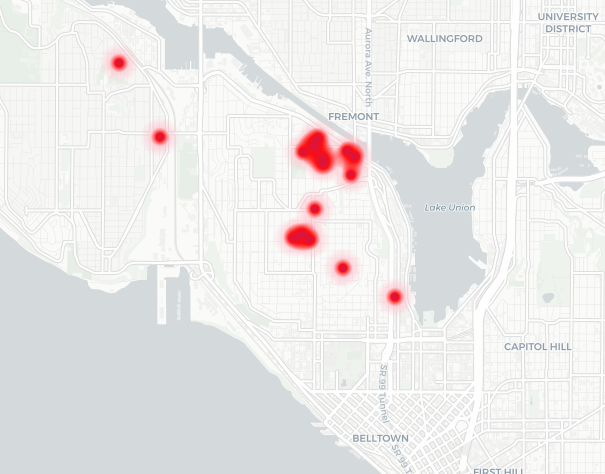

# A Reproducible and Replicable Spatially Explicit Agent-Based Model Using CyberGIS-Jupyter: A Case Study in Queen Anne Neighborhood, Seattle, WA

**Authors:** Alexander Michels, Jeon-Young Kang, Angie Werner, Brandon Lieberthal, Changzhen Wang, Mishka Vance, and Li Yi

**Abstract:** This notebook walks through how to acquire the necessary geospatial, health, and sociological data required to create a spatially-explicit agent-based model of influenza spread. Using the Queen-Anne neighborhood as an example, we walk though synthesizing a population from geospatial and sociological data using Pattern-Oriented Modeling (POM) and simulating the spread of influenza using the SEIR (Susceptible-Exposed-Infectious-Recovered) model of disease transmission. 

**Data:** all required data is contained in the `data` folder.
